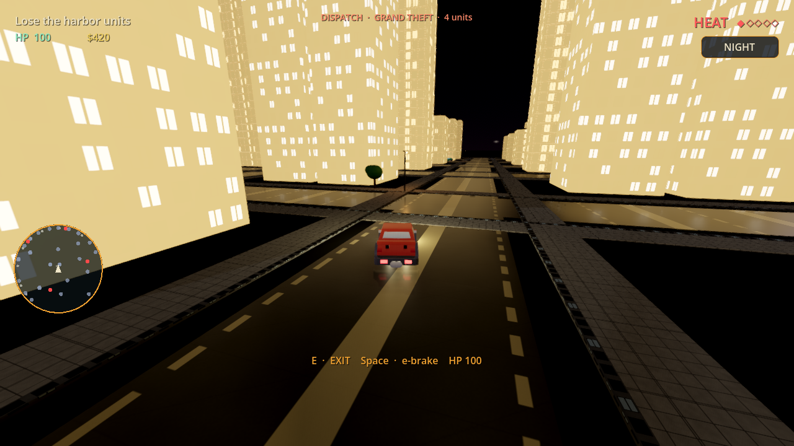
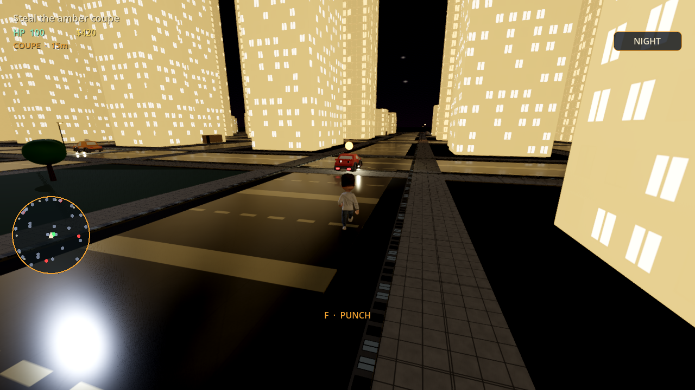
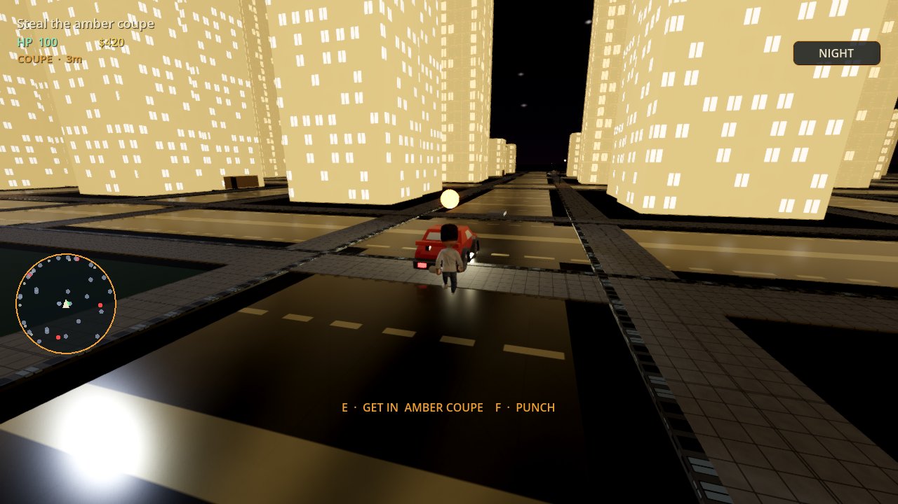
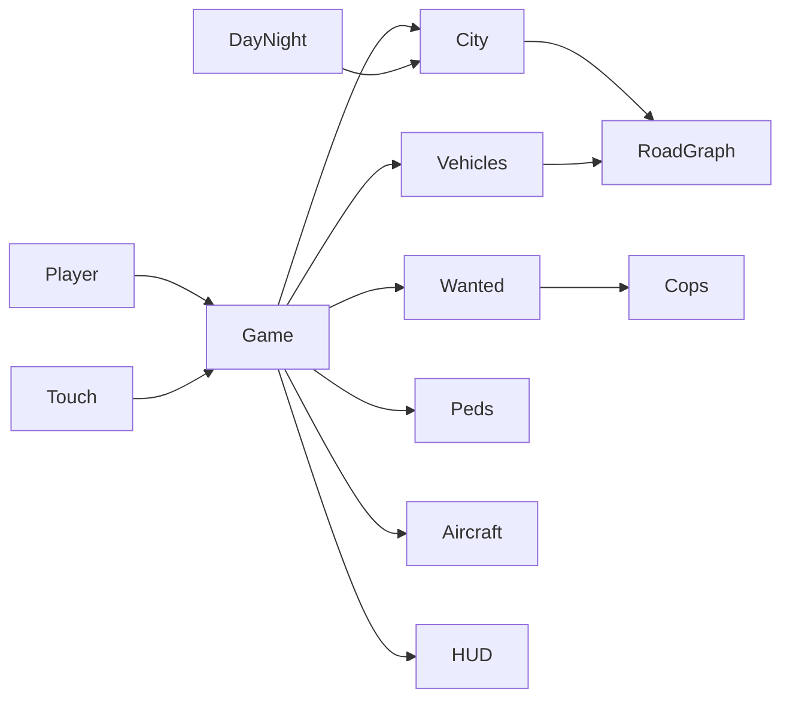

<p align="center">
  
</p>

<p align="center">
  <strong>An original open-world crime sandbox you can fork tonight.</strong><br>
  Playable Godot 4 prototype · Unity 6 mobile track · MIT · CC0 art
</p>

<p align="center">
  <a href="https://github.com/alexbieber/GTA-mini/stargazers"></a>
  <a href="https://github.com/alexbieber/GTA-mini/fork"></a>
  <a href="LICENSE"></a>
  <a href="https://godotengine.org"></a>
  <a href="NightDropUnity/README.md"></a>
  
</p>

<p align="center">
  <a href="#play-in-90-seconds">Play</a> ·
  <a href="#the-loop">The loop</a> ·
  <a href="#what-ships-today">Features</a> ·
  <a href="#good-first-missions">Contribute</a> ·
  <a href="#roadmap">Roadmap</a> ·
  <a href="CONTRIBUTING.md">Contributing guide</a>
</p>

---

<p align="center">
  
  
  
</p>

Night Drop is a **from-scratch open-world crime game**: steal a car, raise heat, lose the harbor units, and make the drop. It is **not affiliated with Rockstar Games** or any existing franchise. Original IP. Original city. Original loop.

The whole Godot game lives in **~20 GDScript files / ~4.6k lines**. That is the point. You can read the wanted system before lunch and land a PR before dinner.

---

## Why this repo exists

Most "open world" GitHub projects are either a 10-year unreadable fork or a cube that says TODO. Night Drop is the other thing:

| | |
|---|---|
| **Playable now** | Steal / heat / deliver already runs in Godot 4.7. |
| **Small enough to own** | City, cars, cops, peds, radar, guns, day/night — readable scripts, not a 400-file soup. |
| **Two engines, one game** | Godot prototype at the repo root. Unity 6 mobile production in [`NightDropUnity/`](NightDropUnity/). |
| **Legal to build on** | MIT code. Kenney, Quaternius, Poly Haven, OpenGameArt — all **CC0**. |
| **Designed for collaborators** | Issues are sliced into one-system missions. See [good first missions](#good-first-missions). |

If you have ever wanted to ship a piece of a living city — traffic AI, a wanted ladder, a gun shop, a pier, a jet — this is the repo to do it in public.

<p align="center">
  <a href="https://github.com/alexbieber/GTA-mini/fork"></a>
  <a href="https://github.com/alexbieber/GTA-mini/issues?q=is%3Aissue+is%3Aopen+label%3A%22good%20first%20issue%22"></a>
</p>

---

## Play in 90 seconds

**Godot (desktop / the fun one)**

1. Install [Godot 4.7](https://godotengine.org/download) (Forward Plus).
2. Clone:

```bash
git clone https://github.com/alexbieber/GTA-mini.git
cd GTA-mini
```

3. In Godot: **Import** → this folder → **Play** (`F5`). Main scene is `scenes/main.tscn`.

**Unity (mobile track)**

Open `NightDropUnity/` in Unity Hub on **6000.0.82f1**. First import runs **Night Drop → Run Phase 0 Setup**. Play `Assets/_Project/Scenes/Bootstrap.unity`. Details in [`NightDropUnity/README.md`](NightDropUnity/README.md).

### Controls

| | On foot | In a car | In the air |
|---|---|---|---|
| Move | `WASD` | `WASD` | `WASD` |
| Look | Mouse | Mouse | Mouse |
| Sprint / e-brake | `Shift` | `Space` | — |
| Enter / exit | `E` | `E` | `E` |
| Punch | `F` | — | — |
| Fire | LMB | LMB | — |
| Cycle guns | `1` `2` `3` / wheel | — | — |
| Day / night | `N` | `N` | `N` |
| Pause mouse | `Esc` | `Esc` | `Esc` |
| After busted / wasted | `R` | `R` | `R` |

Touch sticks and on-screen buttons appear automatically on a phone. Android export preset is already in `export_presets.cfg` (`com.nightdrop.game`).

---

## The loop

```
TITLE  →  STEAL the amber coupe
       →  HEAT  (lose harbor units)
       →  DELIVER packages to the garage
       →  FREE roam  (or BUSTED / WASTED)
```

Heat is a real ladder, not a boolean. Jack a car, ram a civilian, punch a cop, fire a rifle, steal a crate from the army base, or take the AN-2 — each crime adds a different amount, witnesses matter, and stars decay if you stay out of sight.

Then the city keeps running: traffic on a road graph, pedestrians on sidewalk loops, patrol cars hunting your last-seen mark.

---

## What ships today

### Godot — Harbor District

- [x] Procedural grid city with PBR facades, neon windows, water, pier, civic zones
- [x] Third-person walk / sprint / stamina / swim-ready collision
- [x] Enter any parked or civilian car, plus the mission coupe
- [x] Road-graph traffic + cop patrols + chase slots
- [x] Pedestrians on sidewalk paths (officers on the army base)
- [x] 5-diamond **HEAT** system with last-seen, search, and decay
- [x] Mission flow: steal → lose units → drop packages
- [x] Radar with cops, cars, peds, aircraft, and the objective
- [x] Punch, pistol, SMG, rifle, ammo shop, health pickups
- [x] Pay-and-spray, hospital, bar, gun shop, army crates
- [x] Flyable AN-2 + military vehicles
- [x] Day / night HDRI, street lamps, headlights, ACES tonemap, SSAO / SSR
- [x] Full touch HUD for mobile
- [x] Android export preset

### Unity — mobile production

- [x] Phase 0 — project layout, Input System, additive streaming
- [x] Phase 1 — walk / run / jump / swim + camera
- [x] Phase 2 — WheelCollider cars, enter/exit, traffic
- [x] Phase 3 — pedestrians, heat, chasing patrols
- [ ] Phase 4 — melee, guns, health
- [ ] Phase 5 — missions
- [ ] Phase 6 — UI
- [ ] Phase 7 — polish

Audio is the loudest hole. There is **no soundtrack and no SFX yet**. If you are an audio person, this repo will make you a hero in one PR.

---

## Repo map

```
GTA-mini/
├── scenes/main.tscn          Godot entry
├── scripts/                  The whole game (GDScript)
│   ├── game.gd               Loop, input, missions, services
│   ├── city.gd               Harbor grid, shops, base, water
│   ├── vehicle.gd            Cars, cops, traffic AI
│   ├── wanted_system.gd      Heat ladder
│   ├── player.gd             On-foot body
│   ├── pedestrian.gd         Sidewalk brains
│   ├── aircraft.gd           AN-2
│   ├── arsenal.gd            Guns + prices
│   ├── radar.gd / hud.gd     Chrome
│   └── day_night.gd          The sky
├── assets/                   CC0 cars, people, PBR, HDRIs
├── shaders/water.gdshader
├── NightDropUnity/           Unity 6 mobile project (C#)
└── tools/bake_facades.py     Facade helper
```



Physics layers: `world` · `player` · `vehicles` · `cops` · `peds`.

---

## Good first missions

Pick one. Open a PR. We will review it.

| Label | Mission | Why it matters |
|---|---|---|
| `good first issue` · audio | Footsteps, engine loop, a cop radio stinger | The city is silent. This is the highest-impact hour in the repo. |
| `good first issue` · ui | Wanted-star pop animation when heat ranks up | `WantedSystem.just_ranked` already exists. |
| `good first issue` · world | A second district (industrial / marina) | `City` is one grid. Duplicate the pattern, don't rewrite it. |
| `good first issue` · ai | Pedestrians scatter when they hear gunfire | `_scare_nearby` is the hook. |
| `good first issue` · vehicles | Unique handling per `Vehicle.Kind` | Coupe vs cop vs military should not share one top speed. |
| `help wanted` · unity | Phase 4 combat on the mobile track | Isolated C# — do not port Godot code over the wall. |
| `help wanted` · mission | A second story beat after the garage drop | `Phase.FREE` is waiting. |
| `help wanted` · performance | LOD / fade buildings past the radar span | Harbor is dense; mobile will feel it. |

Full setup, style, and PR rules: **[CONTRIBUTING.md](CONTRIBUTING.md)**.

Ideas bigger than a weekend: interior interiors, a radio DJ, wanted-level helicopters, split-screen, a web export, localization, a level editor. File an issue first so two people don't build the same pier.

---

## Roadmap

```
Now        Playable harbor slice (Godot) + Unity phases 0–3
Next       Audio pass · second mission · Unity combat
Soon       A second district · interiors · more vehicles
Later      Full mobile vertical slice · store-ready polish
```

We ship **one system per PR**. A wanted-system tweak should not arrive glued to a new skybox.

---

## Asset credits

Everything under `assets/` is CC0 / public domain unless a file says otherwise. Full list: [`assets/CREDITS.txt`](assets/CREDITS.txt).

- **Kenney** — car kit, animated characters
- **Quaternius** — cars, animated man / woman
- **Poly Haven** — PBR + HDRIs
- **OpenGameArt** — Antonov An-2, jumbo jet

If you add a pack, it must be CC0 or equivalently free to relicense, and you add a line to `CREDITS.txt` in the same PR.

---

## FAQ

**Is this GTA?**  
No. The GitHub repo is named `GTA-mini` as a genre signal. The game is **Night Drop**. Do not copy Rockstar names, maps, vehicles, logos, voices, or missions.

**Which engine should I contribute to?**  
If you want something playable this week, Godot. If you want the mobile product, Unity. Do not mix the two codebases.

**Can I use this commercially?**  
MIT code + CC0 art. Keep the license and credits. Original IP — don't brand it as someone else's franchise.

**Will this hit GitHub Trending?**  
Trending is stars + activity in a short window. The way we get there is real play, real PRs, and people telling other gamedevs. If Night Drop made you boot Godot, star it, fork it, and send a clip. That is the whole strategy.

---

<p align="center">
  <strong>Steal the coupe. Lose the heat. Make the drop.</strong><br>
  <sub>Night Drop is original IP. Not affiliated with Rockstar Games, Take-Two, or any other studio.</sub>
</p>

<p align="center">
  <a href="https://github.com/alexbieber/GTA-mini">github.com/alexbieber/GTA-mini</a>
</p>
